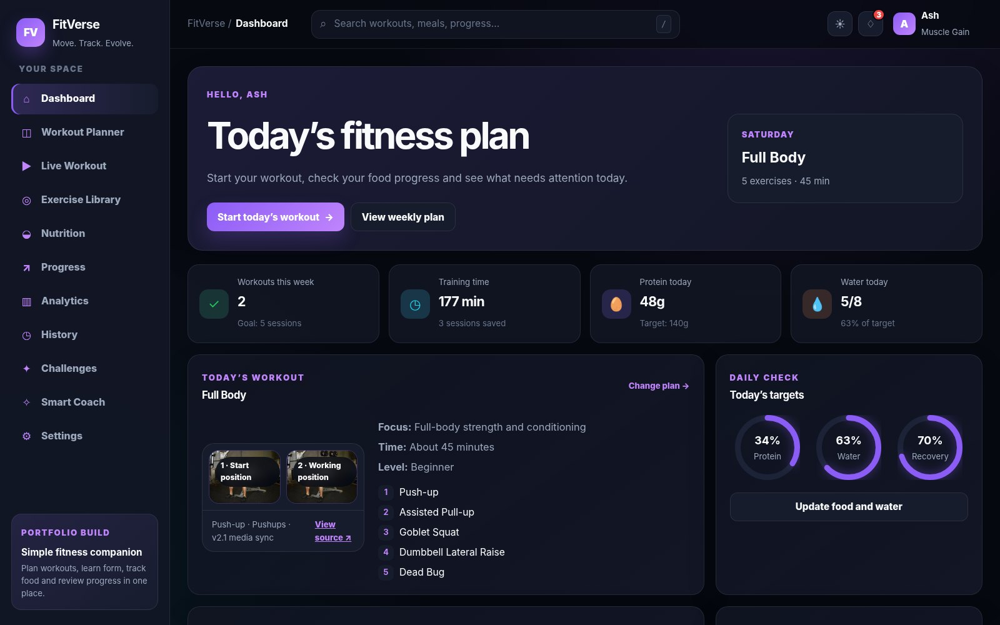
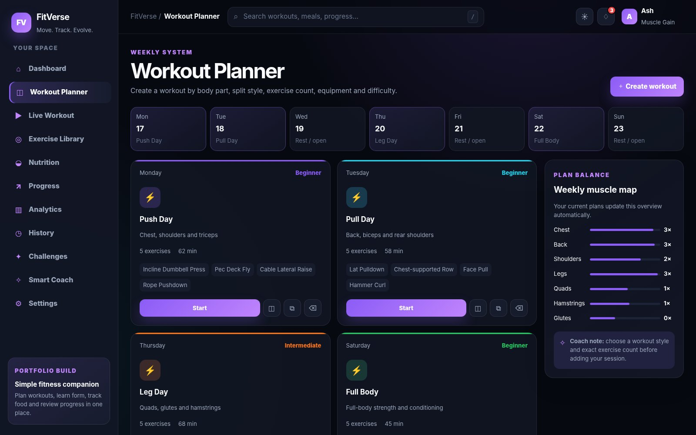
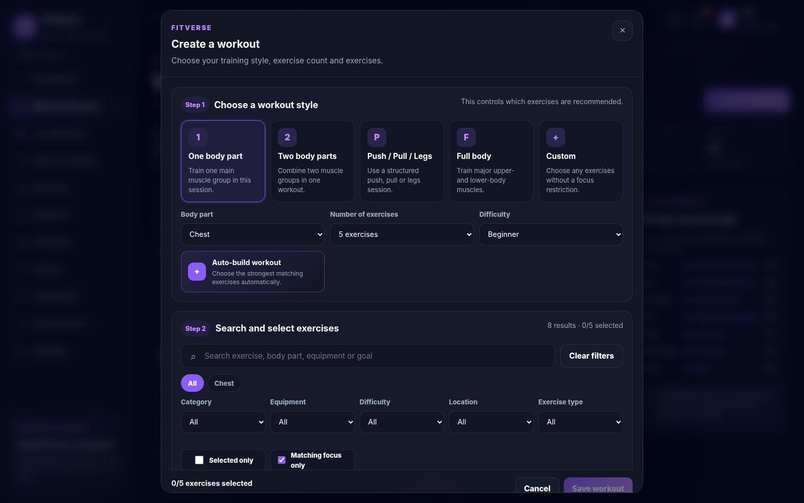
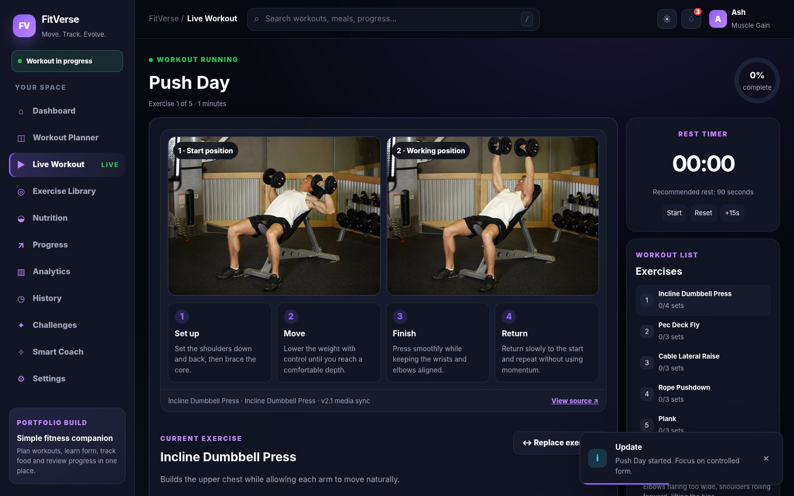
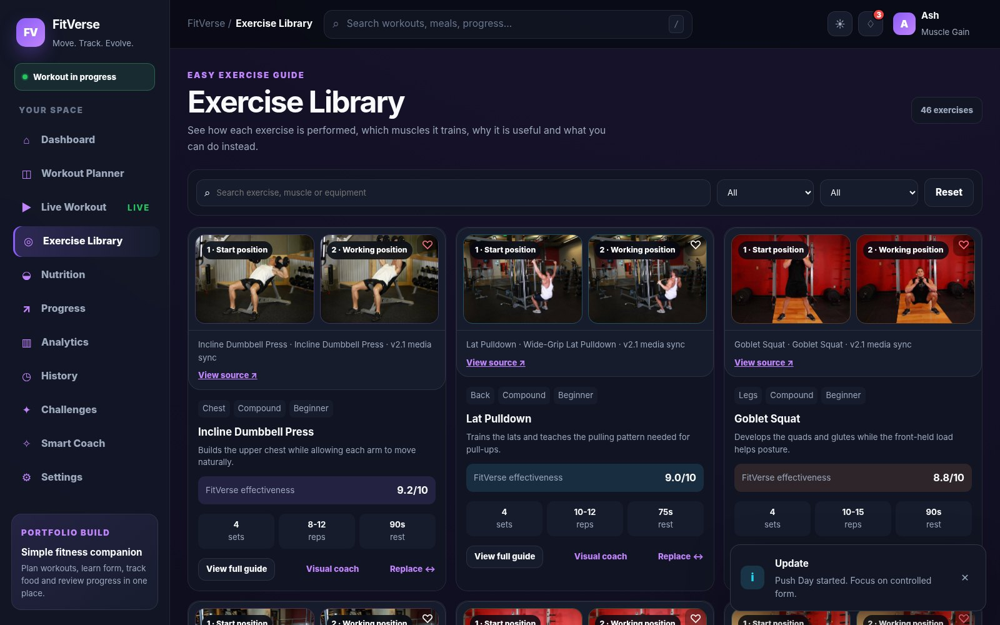
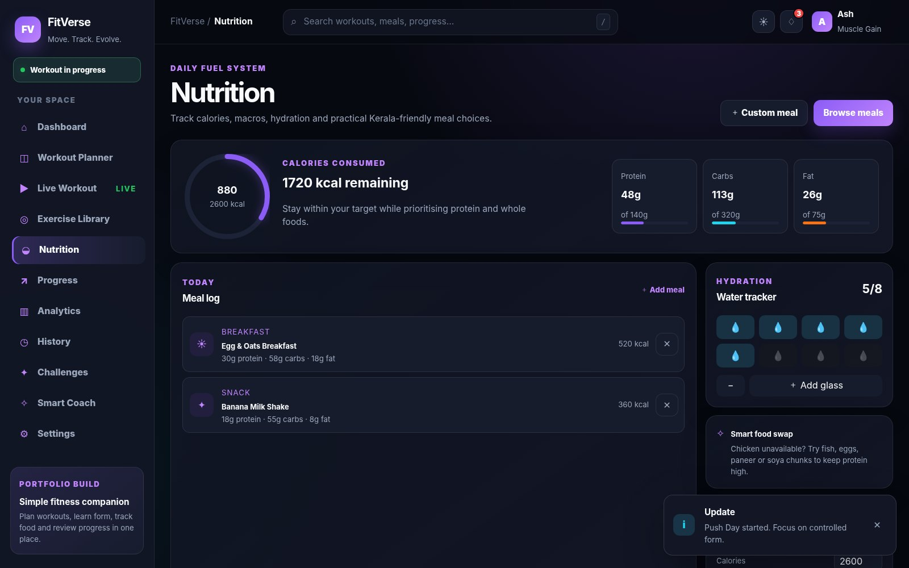
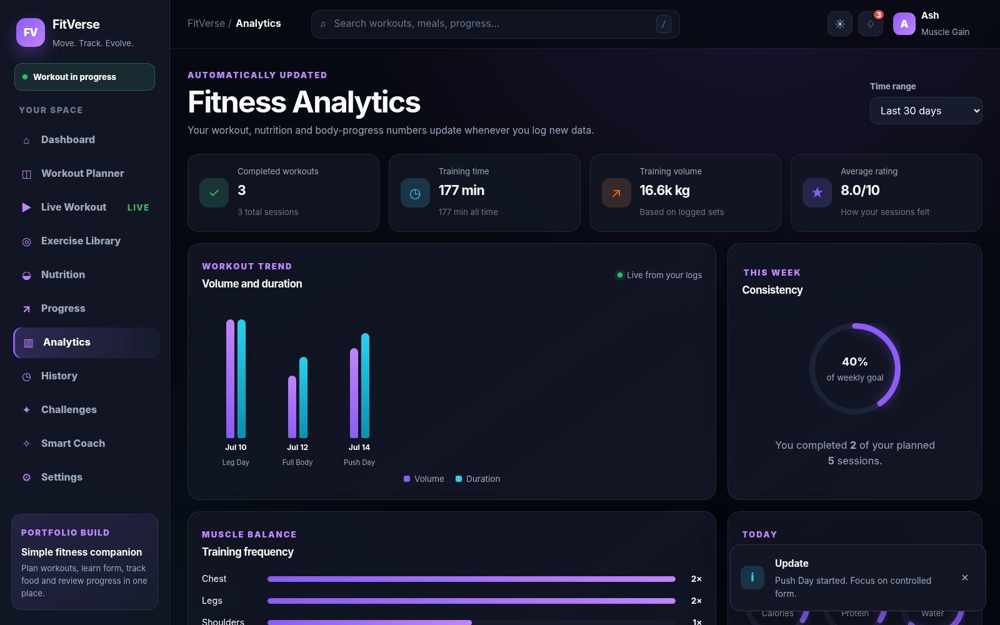

<div align="center">

# FitVerse v2.1

### A modern workout, nutrition and fitness-tracking frontend prototype

Plan workouts, learn exercise form with offline human-photo guides, replace exercises intelligently, track nutrition and review progress from one responsive dashboard.

[](https://ashik-codex.github.io/FitVerse--v2.1/)
[](https://github.com/ashik-codex/FitVerse--v2.1)

[](./docs/screenshots/01-dashboard.jpg)

</div>

## About the project

FitVerse is a **frontend-only fitness companion prototype** built with React and Vite. It is designed for users who want a simple place to create workout plans, understand how exercises are performed, find suitable replacements, track meals and water, and review fitness progress.

The app stores data in the browser with LocalStorage, so it can be demonstrated without a backend or account system. Exercise guide photos are included locally for offline use.

## Main features

### Workout planning

- Weekly workout planner
- Create custom workout plans
- Choose **4–8 exercises** per workout
- One-body-part, two-body-part, Push/Pull/Legs, full-body and custom formats
- Category-wise exercise selection
- Search exercises by name, muscle, equipment or goal
- Muscle, equipment, difficulty, location and exercise-type filters
- Clear search and reset-filter options
- Auto-build workout suggestions
- Reorder or remove selected exercises

### Live workout mode

- Current exercise guide with offline human photos
- Sets, reps and weight tracking
- Rest countdown timer
- Next, previous and workout-queue navigation
- Exercise replacement during a session
- Replacement-specific images update immediately
- Form instructions, target muscles and common mistakes
- Workout completion summary and session rating

### Exercise library

- 46-exercise searchable library
- Human start and working-position photos
- Offline image support
- Primary and secondary muscles
- Sets, reps and rest recommendations
- Exercise benefits and best-use explanation
- Common form mistakes
- Smart replacement suggestions
- Favorites and category filters
- FitVerse comparison rating

### Nutrition and recovery

- Daily calories and macro tracking
- Protein, carbohydrate and fat targets
- Water-intake tracking
- Meal suggestions and food logging
- Kerala-friendly and budget-friendly meal examples
- Recovery and daily-target indicators

### Progress and analytics

- Body-weight and measurement tracking
- Progress-photo upload
- Workout history
- Training time and volume analytics
- Muscle-training frequency
- Nutrition and hydration progress
- Workout consistency and recovery insights
- Dynamic challenges, XP and achievement progress
- Rule-based Smart Coach recommendations

### User experience

- Responsive desktop, tablet and mobile layout
- Dark and light themes
- Readable typography
- Smooth transitions and micro-interactions
- Invisible scrollbars with normal scrolling
- Refresh-safe hash navigation
- Notifications, modals, drawers and toast feedback
- LocalStorage persistence
- JSON backup and import
- GitHub Pages deployment workflow

## Project gallery

<table>
  <tr>
    <td width="50%"><strong>Workout Planner</strong><br><a href="./docs/screenshots/02-workout-planner.jpg"></a></td>
    <td width="50%"><strong>Custom Workout Builder</strong><br><a href="./docs/screenshots/03-workout-builder.jpg"></a></td>
  </tr>
  <tr>
    <td width="50%"><strong>Live Workout</strong><br><a href="./docs/screenshots/04-live-workout.jpg"></a></td>
    <td width="50%"><strong>Exercise Library</strong><br><a href="./docs/screenshots/05-exercise-library.jpg"></a></td>
  </tr>
  <tr>
    <td width="50%"><strong>Nutrition</strong><br><a href="./docs/screenshots/06-nutrition.jpg"></a></td>
    <td width="50%"><strong>Analytics</strong><br><a href="./docs/screenshots/07-analytics.jpg"></a></td>
  </tr>
</table>

## Tech stack

| Technology | Purpose |
|---|---|
| React 18 | Component-based user interface |
| Vite | Development server and production build |
| JavaScript | Application logic and dynamic features |
| CSS | Responsive layout, themes and animations |
| LocalStorage | Browser-based data persistence |
| Git & GitHub | Version control and source hosting |
| GitHub Pages | Live frontend deployment |

## Run locally

### Requirements

- Node.js 18 or newer
- npm

### Installation

```bash
# Clone the repository
git clone https://github.com/ashik-codex/FitVerse--v2.1.git

# Open the project folder
cd FitVerse--v2.1

# Install dependencies
npm install

# Start the development server
npm run dev
```

Open the localhost URL shown in the terminal, usually:

```text
http://localhost:5173/
```

## Available commands

```bash
npm run dev          # Start local development server
npm run build        # Create the production build
npm run preview      # Preview the production build locally
npm run lint         # Check the project with ESLint
npm run verify:media # Verify important exercise media mappings
```

## Project structure

```text
FitVerse--v2.1/
├── public/
│   └── exercise-media/       # Offline exercise photos
├── src/
│   ├── components/           # Shared UI components
│   ├── context/              # Global fitness state and actions
│   ├── data/                 # Exercises, meals and starter data
│   ├── hooks/                # Reusable React hooks
│   ├── pages/                # Main application pages
│   ├── utils/                # Exercise matching and helper logic
│   ├── App.jsx               # Main application layout and navigation
│   ├── index.css             # Global design system and responsive styles
│   └── main.jsx              # React entry point
├── docs/screenshots/         # README screenshots
├── package.json
└── vite.config.js
```

## How the data works

FitVerse uses React state for live interface updates and LocalStorage for persistence. When the user creates a workout, replaces an exercise, logs nutrition or finishes a session, the relevant state is updated and saved in the current browser.

Because this is a frontend prototype:

- Data is not synchronized across devices
- Clearing browser storage removes saved data
- There is no real login or multi-user database
- Smart Coach suggestions are rule-based, not generated by a medical AI system

## Exercise media

Exercise photos are based on the public-domain **Free Exercise DB** dataset and are stored inside the project for offline use. Each supported exercise has its own media mapping so that changing or replacing an exercise also changes the displayed image.

Source: [Free Exercise DB](https://github.com/yuhonas/free-exercise-db)

## Deployment

The project includes a GitHub Pages workflow. The live version is available at:

**https://ashik-codex.github.io/FitVerse--v2.1/**

For a repository deployment, ensure the Vite base path matches the repository path or uses the included relative configuration.

## Known limitations and future scope

FitVerse is currently a portfolio-oriented frontend prototype. Future improvements may include:

- Real authentication and user accounts
- Node.js/Express backend
- Database synchronization
- Cloud image storage
- Real AI-based workout recommendations
- Exercise-video support
- Wearable-device integration
- Server-side analytics and progress reports
- Automated testing

## Health disclaimer

FitVerse is an educational fitness prototype. It does not provide medical diagnosis and is not a replacement for qualified medical, physiotherapy, nutrition or personal-training advice. Users with injuries, pain or medical conditions should consult an appropriate professional before following an exercise or diet plan.

## Author

Built as a CSE learning and portfolio project by **Ashik**.

- GitHub: [@ashik-codex](https://github.com/ashik-codex)
- Live project: [FitVerse v2.1](https://ashik-codex.github.io/FitVerse--v2.1/)

---

<div align="center">
  <strong>FitVerse v2.1 — Plan. Train. Track. Improve.</strong>
</div>
